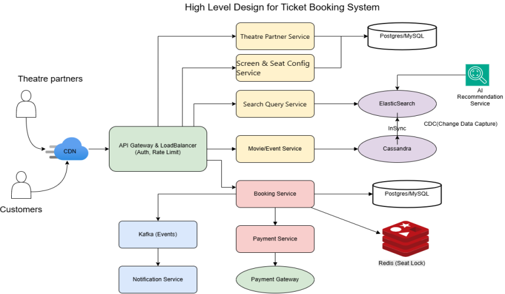
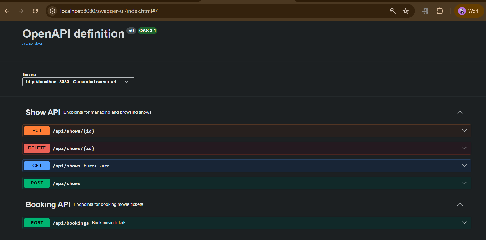

# Booking Service

This project is a backend service for a movie ticket booking system. It provides RESTful APIs for managing movies, theatres, screens, seats, shows, and bookings. The service is built with Java and Spring Boot, and uses a relational database (H2/MySQL/PostgreSQL) for persistence.

---

## High Level Architecture



---

## API Documentation

The service exposes its API documentation using Swagger UI. You can access it at:

```
http://localhost:8080/swagger-ui/index.html
```



---

## API Endpoints

### Show API
- `GET /api/shows` — Browse shows
- `POST /api/shows` — Create a new show
- `PUT /api/shows/{id}` — Update a show
- `DELETE /api/shows/{id}` — Delete a show

### Booking API
- `POST /api/bookings` — Book movie tickets

---

## Entities

- **Movie**: Represents a movie with fields: `id`, `name`, `language`, `genre`.
- **Theatre**: Represents a theatre with fields: `id`, `name`, `city`.
- **Screen**: Represents a screen in a theatre with fields: `id`, `screen_name`, `theatre_id`.
- **Seat**: Represents a seat in a screen with fields: `id`, `screen_id`, `seat_number`, `seat_type`.
- **Show**: Represents a movie show with fields: `id`, `movie_id`, `screen_id`, `show_date`, `show_time`.
- **Booking**: Represents a booking with fields: `id`, `show_id`, `user_name`, `booking_time`.

---

## Setup & Run

1. Clone the repository.
2. Ensure Java and Maven are installed.
3. Run the application:
   ```
   ./mvnw spring-boot:run
   ```
4. Access Swagger UI at [http://localhost:8080/swagger-ui/index.html](http://localhost:8080/swagger-ui/index.html)

---

## Database

The schema and dummy data are initialized from `src/main/resources/data.sql`.

---

## Notes
- The service uses Spring Data JPA repositories for data access.
- Referential integrity is enforced via foreign keys.
- The API is documented using OpenAPI/Swagger.

---

## License

This project is for educational/demo purposes.
